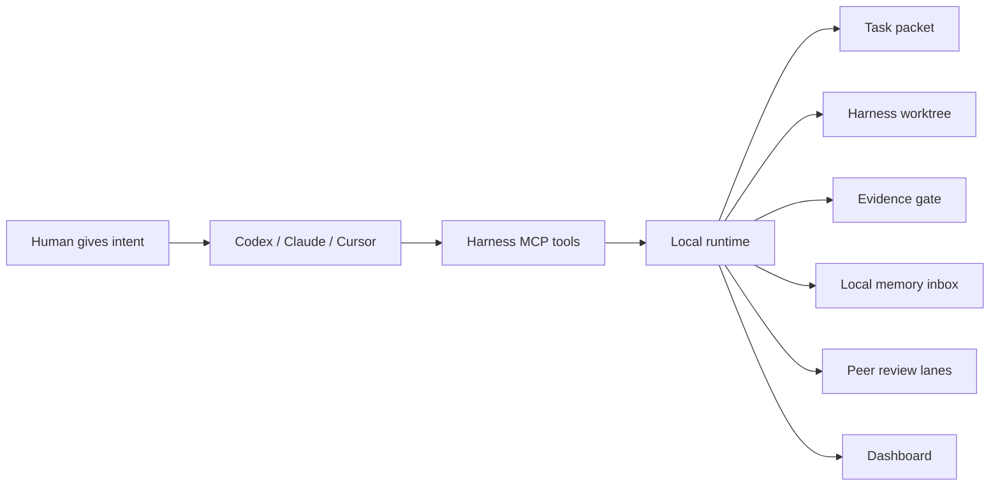
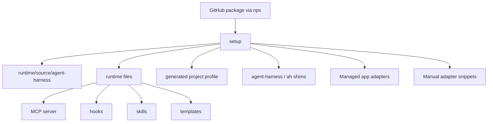
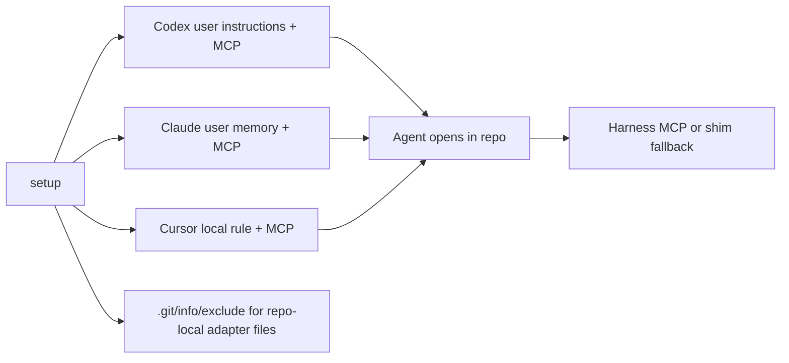
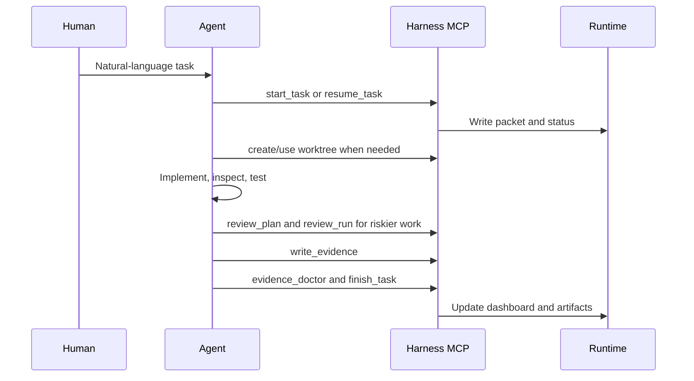
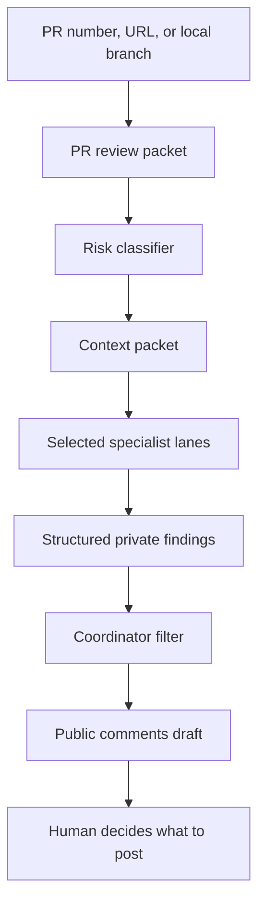
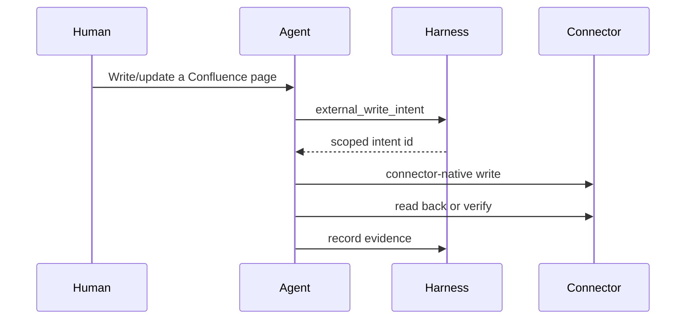

# How It Works

Agent Harness separates generic machinery from local project knowledge.

## Runtime Architecture

The runtime source bundle makes installs independent from the temporary `npx` cache. After setup, the runtime launcher points at the copied bundle.

## App Discovery

The adapter layer is intentionally thin. It tells each agent surface that a harness exists, points it at the local MCP server, and instructs it to start or resume a task instead of asking the human for backend commands.

## Task Lifecycle

## PR Review Flow

The PR flow is draft-only by default. It optimizes for fewer, better comments rather than more AI output.

## External Write Flow

The harness does not export raw tokens. Writes use whatever connector-native auth the agent surface already provides.
